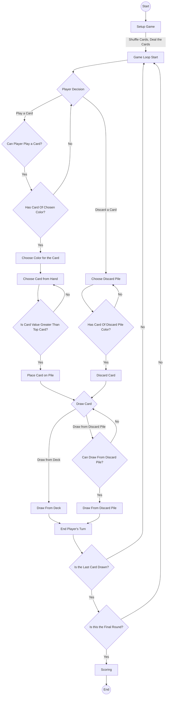

```mermaid
graph TB
    Start((Start)) --> Setup[Setup Game]
    Setup -->|Shuffle Cards, Deal the Cards| GameLoop[Game Loop Start]
    
    GameLoop --> PlayerDecision{Player Decision}
    
    PlayerDecision -->|Play a Card| CanPlayCard{Can Player Play a Card?}
    CanPlayCard -- Yes --> HasColor{Has Card Of Chosen Color?}
    HasColor -- No --> PlayerDecision
    HasColor -- Yes --> ChooseColor[Choose Color for the Card]
    ChooseColor --> ChooseCard[Choose Card from Hand]
    ChooseCard --> IsCardGreater{Is Card Value Greater Than Top Card?}
    IsCardGreater -- No --> ChooseCard
    IsCardGreater -- Yes --> PlaceCard[Place Card on Pile]
    PlaceCard --> DrawCard{Draw Card}
    
    PlayerDecision -->|Discard a Card| ChooseDiscardPile[Choose Discard Pile]
    ChooseDiscardPile --> HasDiscardColor{Has Card Of Discard Pile Color?}
    HasDiscardColor -- No --> ChooseDiscardPile
    HasDiscardColor -- Yes --> DiscardCard[Discard Card]
    DiscardCard --> DrawCard

    DrawCard -->|Draw from Deck| DrawFromDeck[Draw From Deck]
    DrawCard -->|Draw from Discard Pile| CanDrawFromDiscard{Can Draw From Discard Pile?}
    CanDrawFromDiscard -- No --> DrawCard
    CanDrawFromDiscard -- Yes --> DrawFromDiscard[Draw From Discard Pile]
    
    DrawFromDeck --> EndTurn[End Player's Turn]
    DrawFromDiscard --> EndTurn

    EndTurn --> IsLastCard{Is the Last Card Drawn?}
    IsLastCard -- No --> GameLoop
    IsLastCard -- Yes --> IsFinalRound{Is this the Final Round?}
    IsFinalRound -- No --> GameLoop
    IsFinalRound -- Yes --> Scoring[Scoring]
    Scoring --> End((End))
```
