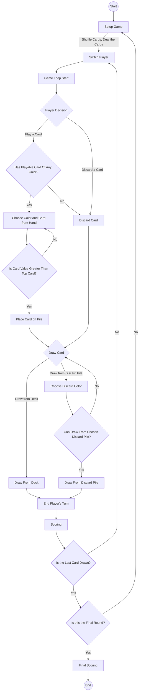

```mermaid
graph TB
    Start((Start)) --> Setup[Setup Game]
    
    Setup -->|Shuffle Cards, Deal the Cards| PlayerSwitch[Switch Player]
    
    PlayerSwitch --> GameLoop[Game Loop Start]
    
    GameLoop --> PlayerDecision{Player Decision}
    
    PlayerDecision -->|Play a Card| HasPlayableCard{Has Playable Card Of Any Color?}
    HasPlayableCard -- No --> DiscardCard[Discard Card]
    HasPlayableCard -- Yes --> ChooseColorAndCard[Choose Color and Card from Hand]
    ChooseColorAndCard --> IsCardGreater{Is Card Value Greater Than Top Card?}
    IsCardGreater -- No --> ChooseColorAndCard
    IsCardGreater -- Yes --> PlaceCard[Place Card on Pile]
    PlaceCard --> DrawCard{Draw Card}
    
    PlayerDecision -->|Discard a Card| DiscardCard
    DiscardCard --> DrawCard

    DrawCard -->|Draw from Deck| DrawFromDeck[Draw From Deck]
    DrawCard -->|Draw from Discard Pile| ChooseDiscardColor[Choose Discard Color]
    ChooseDiscardColor --> CanDrawFromDiscard{Can Draw From Chosen Discard Pile?}
    CanDrawFromDiscard -- No --> DrawCard
    CanDrawFromDiscard -- Yes --> DrawFromDiscard[Draw From Discard Pile]
    
    DrawFromDeck --> EndTurn[End Player's Turn]
    DrawFromDiscard --> EndTurn

    EndTurn --> Scoring[Scoring]
    Scoring --> IsLastCard{Is the Last Card Drawn?}
    IsLastCard -- No --> PlayerSwitch
    IsLastCard -- Yes --> IsFinalRound{Is this the Final Round?}
    IsFinalRound -- No --> Setup
    IsFinalRound -- Yes --> FinalScoring[Final Scoring]
    FinalScoring --> End((End))
```
