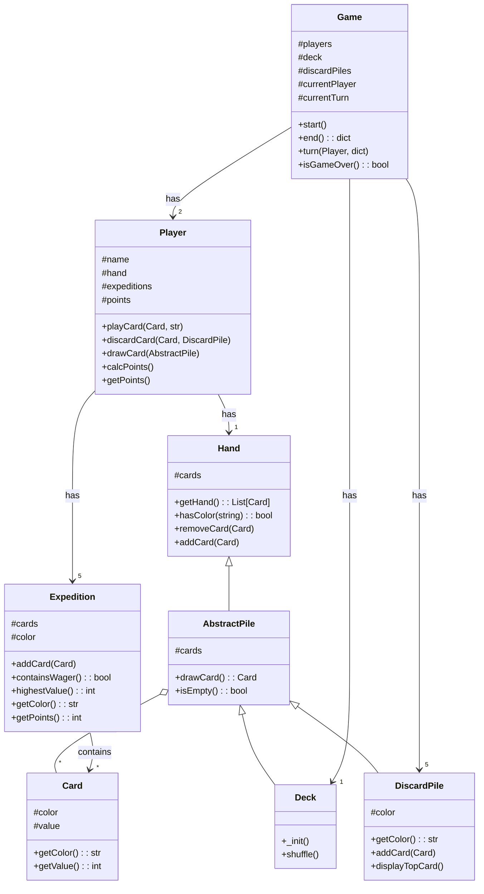

```mermaid
classDiagram
    Game --> "2" Player : has
    Game --> "1" Deck : has
    Game --> "5" DiscardPile : has
    Player --> "1" Hand : has
    Player --> "5" Expedition : has
    Expedition --> "*" Card : contains
    AbstractPile o-- "*" Card : contains
    AbstractPile <|-- Deck
    AbstractPile <|-- DiscardPile
    Hand <|-- AbstractPile
    class Game{
      #players
      #deck
      #discardPiles
      #currentPlayer
      #currentTurn
      +start()
      +end() : dict
      +turn(Player, dict)
      +isGameOver() : bool
    }
    class Player{
      #name
      #hand
      #expeditions
      #points
      +playCard(Card, str)
      +discardCard(Card, DiscardPile)
      +drawCard(AbstractPile)
      +calcPoints()
      +getPoints()
    }
    class AbstractPile{
      #cards
      +drawCard() : Card
      +isEmpty() : bool
    }
    class Card{
      #color
      #value
      +getColor() : str
      +getValue() : int
    }
    class Deck{
      +_init()
      +shuffle()
    }
    class DiscardPile{
      #color
      +getColor() : str
      +addCard(Card)
      +displayTopCard()
    }
    class Hand{
      #cards
      +getHand() : List[Card]
      +hasColor(string) : bool
      +removeCard(Card)
      +addCard(Card)
    }
    class Expedition{
      #cards
      #color
      +addCard(Card)
      +containsWager() : bool
      +highestValue() : int
      +getColor() : str
      +getPoints() : int
    }
```